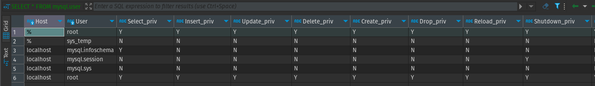
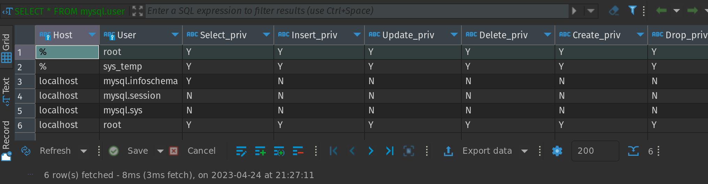
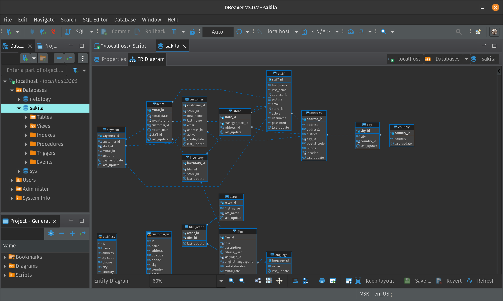

# Домашнее задание к занятию «Работа с данными (DDL/DML)» - `Андрей Сотников`

---

### Задание 1

> 1.1. Поднимите чистый инстанс MySQL версии 8.0+. Можно использовать локальный сервер или контейнер Docker.
> 1.2. Создайте учётную запись sys_temp.  

``` sql
CREATE USER sys_temp identified by '1234'
```

> 1.3. Выполните запрос на получение списка пользователей в базе данных. (скриншот)



> 1.4. Дайте все права для пользователя sys_temp.

``` sql
GRANT ALL PRIVILEGES ON *.* TO 'sys_temp'@'localhost';
```

> 1.5. Выполните запрос на получение списка прав для пользователя sys_temp. (скриншот)



> 1.6. Переподключитесь к базе данных от имени sys_temp.

``` sql
ALTER USER 'sys_test'@'localhost' IDENTIFIED WITH mysql_native_password BY '1234';
```

> 1.7. Cкачайте дамп базы данных.
> 1.8. Восстановите дамп в базу данных.

``` sql
CREATE DATABASE sakila;
```

``` sh
mysql -u sys_temp -p1234 < /var/lib/mysql-dump/sakila-schema.sql
mysql -u sys_temp -p1234 < /var/lib/mysql-dump/sakila-data.sql
```

> 1.9. При работе в IDE сформируйте ER-диаграмму получившейся базы данных (скриншот)



---

### Задание 2

> Составьте таблицу, используя любой текстовый редактор или Excel, в которой должно быть два столбца: в первом должны быть названия таблиц восстановленной базы, во втором названия первичных ключей этих таблиц

| table | PK |
| --- | --- |
| actor | actor_id |
| address | address_id |
| category | category_id |
| city | city_id |
| country | country_id |
| customer | customer_id |
| film | film_id |
| film_actor | actor_id |
| film_actor | film_id |
| film_category | film_id |
| film_category | category_id |
| film_text | film_id |
| inventory | inventory_id |
| language | language_id |
| payment | payment_id |
| rental | rental_id |
| staff | staff_id |
| store | store_id |
